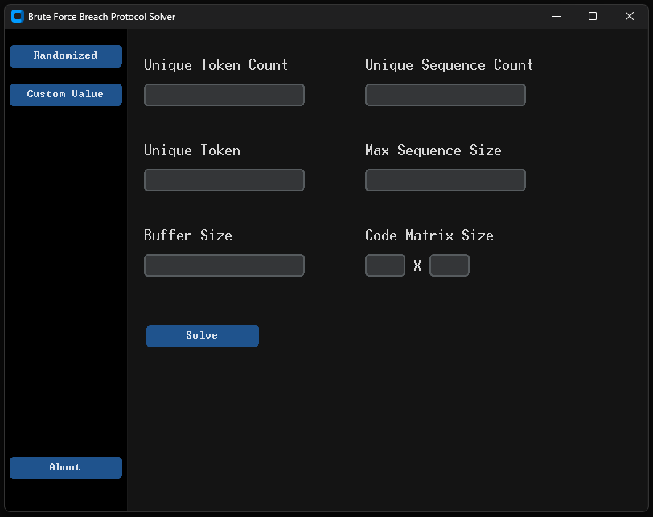
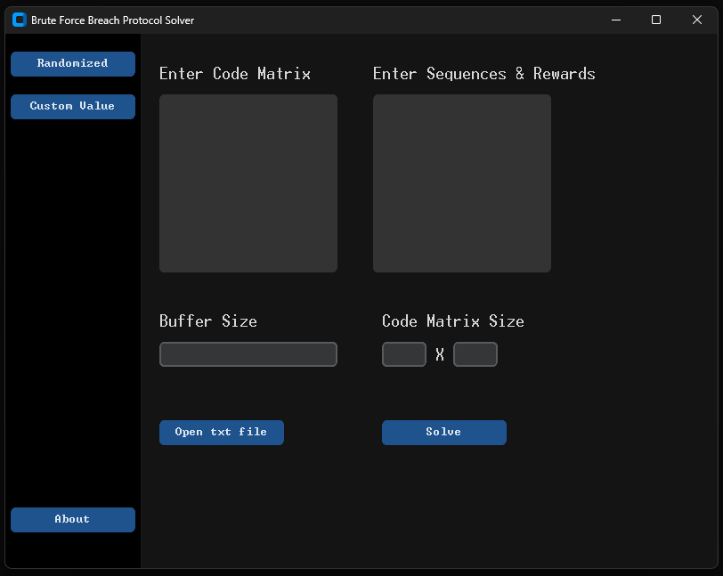
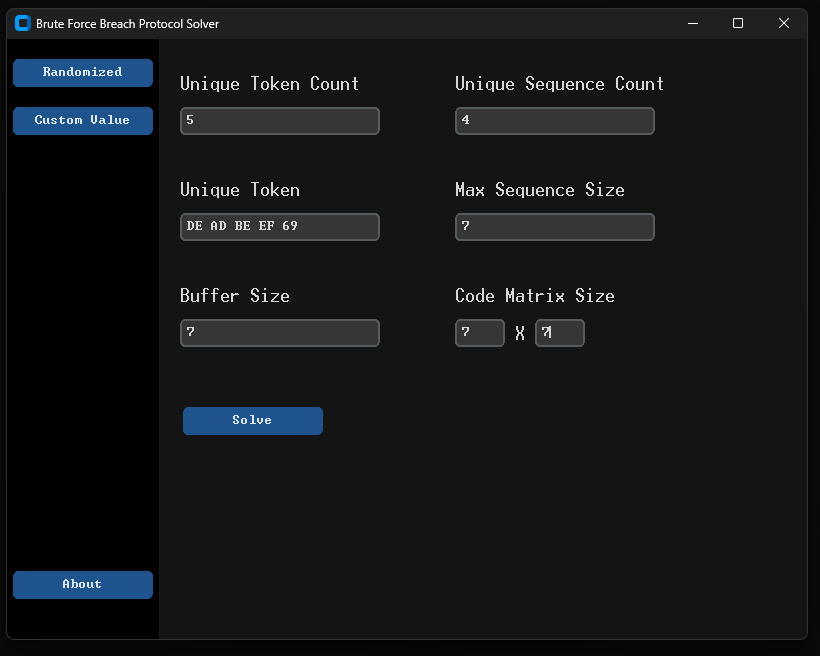
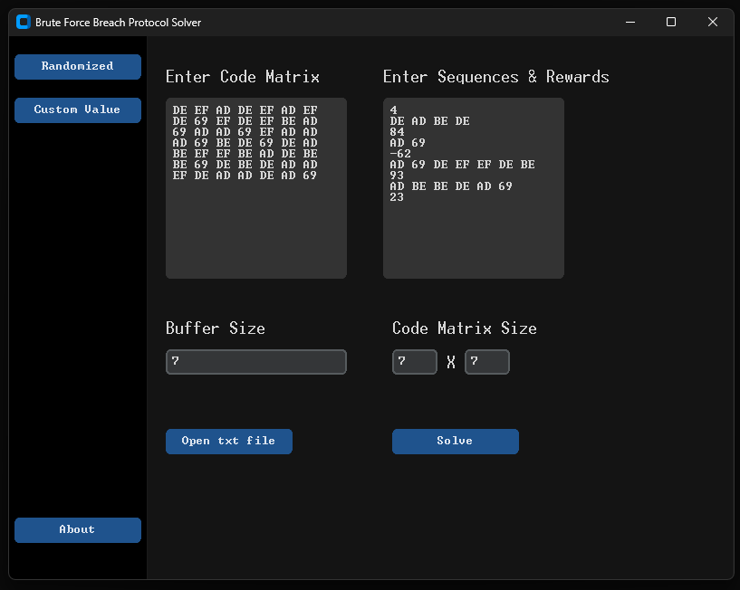
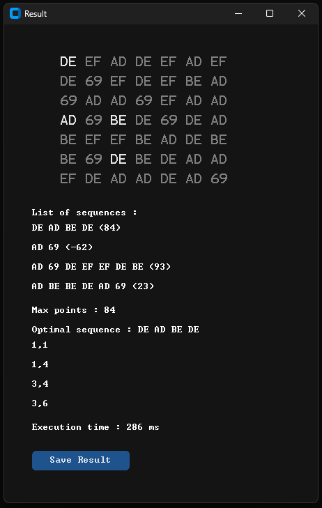

# Tugas Kecil 1 IF2211 Strategi Algoritma
## Deskripsi Program -  Breach Protocol Solver
Sebuah program yang bertujuan untuk menyelesaikan minigame breach protocol seperti pada permainan video Cyberpunk 2077. Program ini akan mengeluarkan susunan token, reward point terbesar yang bisa didapatkan, dan koordinat token untuk mencapai point terbesar.

## Requirement Program
- Python (Tested on Python 3.10.12 & Python 3.11.6)
- pip
- Tkinter
- CustomTkinter
- PyInstaller

## Cara Compile Program
1. Untuk Python versi Windows, umumnya pip dan Tkinter sudah terpasang bersama dengan instalasi Python. Untuk versi Ubuntu, jika pip dan/atau Tkinter belum terpasang, jalankan perintah berikut 
```
sudo apt install python3-pip
sudo apt install python3-tk
```
2. Buka repository dengan terminal, kemudian masuk ke directory `src`
```
cd src
```
3. Jalankan perintah berikut untuk memastikan seluruh requirement sudah terpasang
```
pip install -r requirements.txt
```
4. Compile program utama dengan perintah
```
pyinstaller -F main.py
```
## Cara Menjalankan Program
1. Program dapat dijalankan langsung dengan menjalankan executable `main.exe` yang ada pada directory `bin` atau melalui terminal dengan menjalankan perintah berikut pada directory `src`
```
python3 main.py
```
2. Klik tombol di bagian samping kiri untuk memilih mode input
   
   

3. Masukkan input pada entry yang tersedia, atau dapat juga dengan memilih 'Open txt file' pada input 'Custom Value'
   
   

4. Klik 'Solve' dan akan muncul pop up solusi. Klik 'Save Result' untuk menyimpan solusi  
    

## Author
Created by M. Hanief Fatkhan Nashrullah (13522100)  
email : 13522100@std.stei.itb.ac.id
